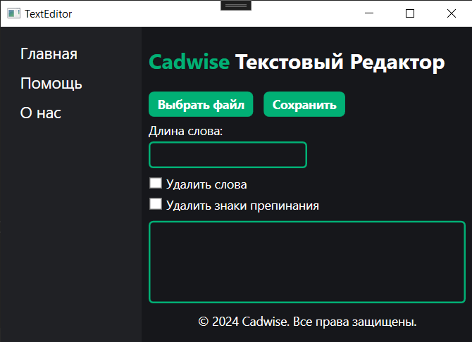

# Cadwise Text Editor

## Краткое описание

Cadwise Text Editor — это простое и удобное средство для обработки текстовых файлов.
Приложение предлагает пользователю выбрать интересующий для обработки файл, после чего установить необходимыые настройки и
обработать текстовый документ. Утилита обладает интуитивно понятным интерфейсом, что делает её доступной для всех категорий пользователей.

## Пользователтский интерфейс

Рис. №1 - Пользовательский интерфейс

### Основные элементы пользовательского интерфейса

- **Панель навигации**

- **Основной контент**

  - _Страница "Главная"_

    

    Рис. №2 - Страница "Главная"

  - _Страница "Помощь"_

    

    Рис. №3 - Страница "Помощь"

  - _Страница "О нас"_

    

    Рис. №4 - Страница "О нас"

### Основные элементы управления пользовательского интерфейса

1. **Кнопка "Выбрать файл":**

   Позволяет пользователю выбрать текстовый файл для обработки. При нажатии открывается диалог выбора файла;

2. **Кнопка "Сохранить":**

   Сохраняет обработанный текстовый файл. Название обработанного файла генерируется автоматически, исходя из названия входного файла;

3. **Поле "Длина слова":**

   Поле ввода, где пользователь может задать минимальную длину слова для удаления. Это позволяет контролировать, какой длины слова будут исключены из текста;

4. **Чекбокс "Удалить слова":**

   Позволяет активировать или деактивировать функцию удаления слов определенной длины, заданной в поле "Длина слова";

5. **Чекбокс "Удалить знаки препинания":**

   Включает или выключает удаление всех знаков препинания из текста;

6. **Выводный текст:**

   Область для отображения пути к выбранному файлу или результатов обработки текста. Здесь пользователь может видеть, какое действие было выполнено;

## Интересные моменты программного средства

### Поддержка пакетной обработки файлов

Программное средство позволяет пользователю выбрать несколько файлов для обработки. Обработка выбранных файлов проходит в порядке очереди.

### Асинхронная обработка файлов и эффективное управление памятью

Во время работы приложения обработка файлов происходит в асинхронном "режиме". Такой подход позволяет задаче обработки файлов выполняться в фоновом режиме,
не блокируя основной поток выполнения. Это означает, что обработка файлов даже больших объемов позволяет приложению оставаться отзывчивым.

В реализации логики обработки используется StringBuilder, что позволяет эффективно управлять памятью и избегать затрат на создание нового объекта строки каждый раз,
когда происходит добавление подходящего под условия слова.
